# Sprint 2 Plan

**Goal:** Close out Sprint 1: turn the job-copilot-workflow.html roadmap's "✓ Built" status for
steps 1, 2, and 10–20 from a claim into something actually true, by finishing every
partially-complete piece and fixing the real-world bugs a live test surfaces — before Sprint 2+
moves on to the job search and discovery work (steps 3–9) the roadmap has planned next.

**Why this:** It is because I need to complete the project and test it in real world and get real
user feedbacks. The workflow diagram marks every Sprint 1 step as "✓ Built," but running the
actual pipeline against my own real resume and a real job posting this week proved that wasn't
true yet. Closing those gaps now, honestly, is what makes the rest of the roadmap (job search,
auto-apply) worth building on top of — there's no point scouting real jobs in Sprint 2+ if the
tailoring underneath still breaks on a real resume.

## The problem this sprint addresses

`job-copilot-workflow.html` marks every Sprint 1 step (1, 2, 10–20) as **✓ Built**. Until this
sprint, nobody had actually run the pipeline against a real resume and a real job posting — every
prior test used synthetic profiles and job descriptions written to exercise a specific code path.
On 2026-09-22 I ran it for the first time as a real user, against my own resume and a real AT&T
job posting. It surfaced problems that no synthetic test had, and one of them — a resume rewrite
that appeared to invent a specific, fabricated achievement — is exactly the failure mode the
entire "never manufacture qualifications" principle exists to prevent.

## How the pipeline actually works, end to end — all 24 spec steps

This is every step from `specs/001-job-application-copilot.md`, organized by the sprint each
belongs to, colored by what's actually true today (not the aspirational version in
`job-copilot-workflow.html`):

- 🟩 **Green** — built and verified working (including against real data this sprint)
- 🟧 **Amber** — was claimed "✓ Built" but had a real bug found and fixed this sprint
- ⬜ **Gray** — not started yet (Sprint 2+/3+ scope)

```mermaid
flowchart TD
    subgraph S1["SPRINT 1 — Resume Tailoring MVP"]
        direction TB
        n1["1. Upload Resume"] --> n2["2. Career Truth Profile"]
        n2 --> n10["10. Analyze Job Description"]
        n10 --> n11["11. Benchmark Resume"]
        n11 --> n12["12. Gap Report (A-E)"]
        n12 --> n13["13. Tailor Resume"]
        n13 --> n14["14. Optimize Toward Target"]
        n14 --> n15["15. Control Length"]
        n15 --> n16["16. Preserve Design"]
        n16 --> n17["17. Generate PDF"]
        n17 --> n18["18. PDF Validation"]
        n18 --> n19["19. Final Application Report"]
        n19 --> n20["20. Show Changes"]
    end

    subgraph S2["SPRINT 2+ — Job Search & Discovery"]
        direction TB
        n3["3. Set Job Search Goals"] --> n4["4. Select Job Sources"]
        n4 --> n5["5. Scout Open Jobs"]
        n5 --> n6["6. Clean & Validate Results"]
        n6 --> n7["7. Job Discovery Dashboard"]
        n7 --> n8["8. Calculate Candidate Fit"]
        n8 --> n9["9. User Triage"]
    end

    subgraph S3["SPRINT 3+ — Application Submission"]
        direction TB
        n21["21. Choose Application Mode"] --> n22["22. Record Submission"]
        n22 --> n23["23. Update Application Status"]
        n23 --> n24["24. Application Dashboard"]
    end

    n9 -->|"user marks a job Apply"| n1
    n20 -->|"user reviews & submits"| n21

    style n1 fill:#fef3c7,stroke:#d97706
    style n2 fill:#dcfce7,stroke:#16a34a
    style n10 fill:#dcfce7,stroke:#16a34a
    style n11 fill:#dcfce7,stroke:#16a34a
    style n12 fill:#fef3c7,stroke:#d97706
    style n13 fill:#fef3c7,stroke:#d97706
    style n14 fill:#dcfce7,stroke:#16a34a
    style n15 fill:#dcfce7,stroke:#16a34a
    style n16 fill:#fef3c7,stroke:#d97706
    style n17 fill:#dcfce7,stroke:#16a34a
    style n18 fill:#dcfce7,stroke:#16a34a
    style n19 fill:#fef3c7,stroke:#d97706
    style n20 fill:#dcfce7,stroke:#16a34a
    style n3 fill:#f3f4f6,stroke:#9ca3af
    style n4 fill:#f3f4f6,stroke:#9ca3af
    style n5 fill:#f3f4f6,stroke:#9ca3af
    style n6 fill:#f3f4f6,stroke:#9ca3af
    style n7 fill:#f3f4f6,stroke:#9ca3af
    style n8 fill:#dcfce7,stroke:#16a34a
    style n9 fill:#f3f4f6,stroke:#9ca3af
    style n21 fill:#f3f4f6,stroke:#9ca3af
    style n22 fill:#f3f4f6,stroke:#9ca3af
    style n23 fill:#f3f4f6,stroke:#9ca3af
    style n24 fill:#f3f4f6,stroke:#9ca3af
```

Note on item 8: the workflow diagram marks "Calculate Candidate Fit" as Sprint 2 "Planned," but
it's actually already built and live-tested in `apps/api` (`CandidateFitScorer`, wired into both
`/jobs/upsert` and `/tailor/preview`) — ahead of the diagram, not behind it. Everything else in
Sprint 2+ and 3+ (job source selection, scouting, the dashboard, and all of application
submission/tracking) is genuinely not started; some scaffolding code exists for ATS auto-apply in
`product/resume_tailorer/applications/` but it isn't wired to anything real yet.

## What the workflow diagram claimed vs. what was actually true (before this sprint)

| Spec item | Diagram status | What was actually true |
|---|---|---|
| 1. Upload Resume | ✓ Built | The original file was discarded after parsing, not preserved — spec explicitly requires it never be overwritten |
| 12. Gap Report | ✓ Built | A qualification whose only real content was a short acronym (e.g. "AWS") was misclassified "truly missing" even when clearly present |
| 13. Tailor Resume | ✓ Built | The LLM sometimes appended commentary about its own reasoning directly into the resume text |
| 16. Preserve Design | ✓ Built | `apps/api` never passed style hints (bullet character, heading style) to PDF generation at all |
| 19. Final Application Report | ✓ Built | Candidate Fit Score was hardcoded to `None`; "unsupported claims added" (the spec's own fabrication metric) wasn't tracked anywhere |

## Bugs found and fixed via real-world testing (2026-09-22)

Running the pipeline against my own real resume and a real job posting — not synthetic test data —
surfaced nine real, previously-invisible bugs, in roughly the order they were found:

1. **Empty skills list.** My resume labels that section "Technical Proficiency" / "Core
   Competencies"; the parser only recognized the literal word "Skills."
2. **Dropped bullet content.** Long bullets that PDF text extraction wraps onto a second line were
   silently discarded instead of merged — real accomplishments were vanishing from my profile.
3. **Scrambled job entries.** The parser split a job title away from its own company line whenever
   the company name wasn't in ALL CAPS, corrupting employer/title/dates and losing that job's
   bullets entirely.
4. **Apostrophe mismatch.** A real job posting used a Unicode curly apostrophe ("you'll") where the
   parser's regex only recognized a straight one, silently failing every "What you'll do/need/bring"
   heading match.
5. **Truncated sections.** A posting that separates every sentence with a blank line (no bullet
   markers) had its "requirements" section cut off after the very first sentence.
6. **Fragmented words.** Splitting on every hyphen broke ordinary words like "full-time" and
   "cross-functional" into nonsense pieces mid-sentence.
7. **Invented fake requirements.** The fallback keyword extractor picked up ordinary sentence
   filler ("Earned," "degree," "seven") as if each were a required skill, then flagged "degree" as
   **truly missing** — despite my resume clearly showing one.
8. **No safeguard against a too-thin profile.** With almost nothing real to work from (because of
   bugs 1–2), the system still called the LLM anyway instead of refusing — this is what produced
   the apparent fabrication. There is now a hard gate: if a profile has no skills and no work
   history content, tailoring is refused with a clear error instead of silently proceeding.
9. **A crash in my own test script** on Windows' non-UTF-8 console codepage, which happened to
   crash exactly when it had something important to show me.

All nine are fixed, covered by new regression tests, and re-verified against the real files that
originally exposed them. Full detail is in this session's transcript and in `decisions/`.

## Done looks like

A user can upload a resume and paste a real job description, get a tailored resume that reaches
85%+ alignment when they're a genuine match for the role (or an honest report of the ceiling and
what's missing when they're not), export it as a validated PDF — and at least 2 real people other
than me can do this themselves without my help.

## Definition of done

- [x] Original resume file is preserved, not just parsed-and-discarded (spec item 1).
- [x] Short-acronym qualifications (e.g. "AWS") are classified correctly, not marked falsely missing.
- [x] LLM commentary/notes can no longer leak into the tailored resume text.
- [x] PDF generation uses style hints extracted from the user's actual original resume.
- [x] Candidate Fit Score and "unsupported claims added" are real fields, not placeholders.
- [x] A profile too sparse to tailor honestly is refused with a clear error, not silently tailored.
- [x] All nine bugs found during real-world testing are fixed and covered by regression tests.
- [ ] At least 2 real people other than me have used the tool on their own resume and given feedback.

**Predicted difficulty:** 4
